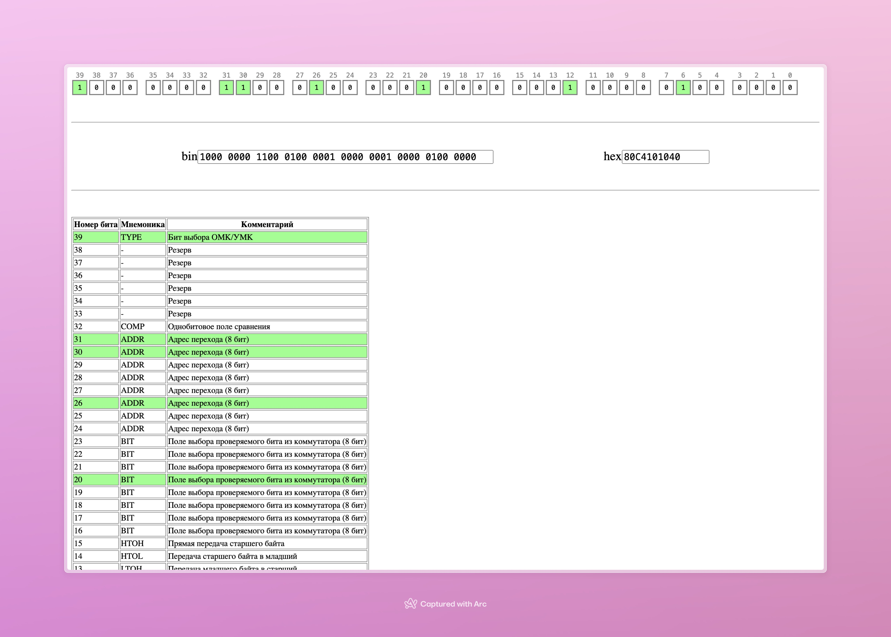

# MicroCMDCheatsheet

Мини помощник в составлении микрокоманд БЭВМ для 7 лабы

  

Потыкать можно тут https://lavrentious.github.io/microcmdcheatsheet

## Запуск
Локально через NodeJS

1. Склонируйте репо
2. Установите всё `npm install`
3. Запустите `npm run start`

По умолчанию запускается на http://localhost:3000